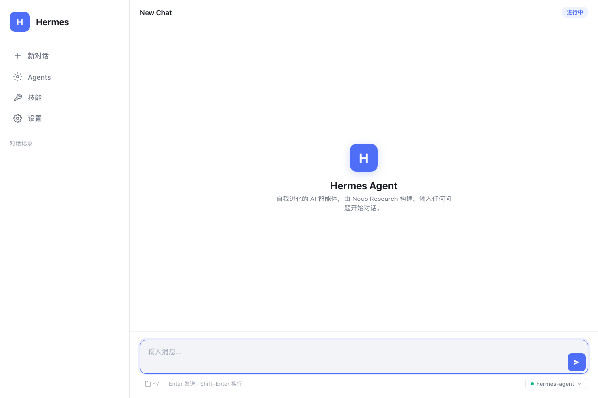
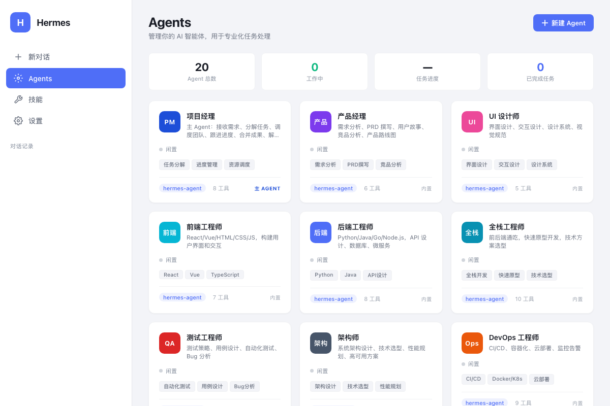
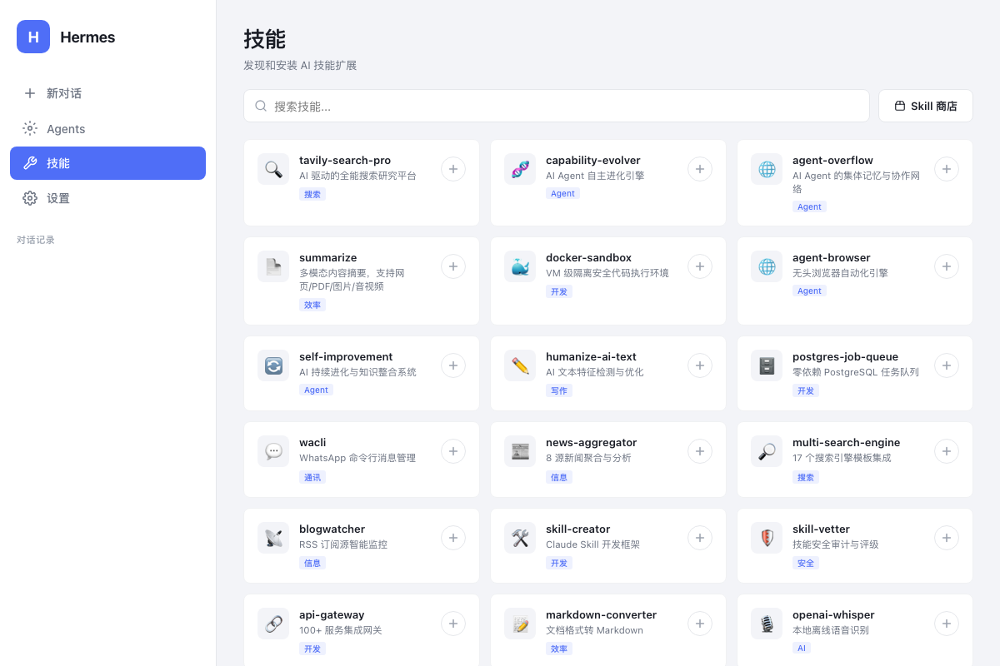
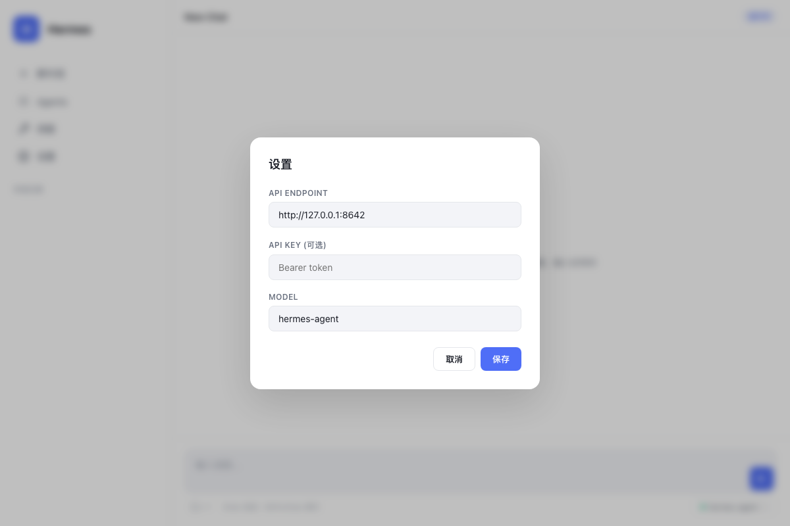

<p align="center">
  
</p>

<h1 align="center">Hermes Agent Desktop</h1>

<p align="center">
  <strong>Multi-Agent Collaboration Desktop Client for Hermes Agent</strong>
</p>

<p align="center">
  <a href="#features">Features</a> &bull;
  <a href="#screenshots">Screenshots</a> &bull;
  <a href="#quick-start">Quick Start</a> &bull;
  <a href="#configuration">Configuration</a> &bull;
  <a href="#architecture">Architecture</a> &bull;
  <a href="#license">License</a>
</p>

<p align="center">
  
  
  
  
</p>

---

A beautiful, native desktop client for [Hermes Agent](https://github.com/NousResearch/hermes-agent) with **multi-agent collaboration**, **20 built-in AI specialists**, and a **project manager orchestrator** that automatically decomposes tasks and delegates to the right experts.

Built with a clean Apple-inspired design, it works with any OpenAI-compatible LLM provider including Alibaba DashScope (Qwen, Kimi K2.5), DeepSeek, OpenAI, Anthropic, and OpenRouter.

---

## Features

### Multi-Agent Collaboration System

- **20 Built-in AI Agents** — Project Manager, Product Manager, UI Designer, Frontend/Backend/Full-stack Engineers, QA, Architect, DevOps, Data/AI Engineer, Security Expert, Operations, Marketing, Business Analyst, Tech Writer, Translator, Legal Counsel, DBA, Creative Director
- **Project Manager as Orchestrator** — Automatically receives requirements, decomposes tasks, delegates to specialists, tracks progress, and synthesizes deliverables
- **Real-time Agent Status** — Dashboard showing which agents are active, task progress, and completion stats
- **Agent CRUD** — Create, edit, and delete custom agents with configurable system prompts, models, and skill tags

### Chat Interface

- **Streaming SSE Responses** — Real-time token-by-token display with typing cursor animation
- **Multi-Agent Response Sections** — Clearly labeled sections showing which agent contributed what
- **Rich Markdown Rendering** — Headings, code blocks with syntax highlighting & copy button, tables, blockquotes, lists, inline code
- **Tool Call Indicators** — Collapsible panels showing agent tool usage, auto-collapsed after completion
- **Session Management** — Multiple conversations with history, auto-save to localStorage

### Skill Store

- **50+ Curated Skills** — From CocoLoop Skill Hub, covering search, automation, development, productivity, and more
- **One-Click Install** — Install skills with toast notification feedback
- **Search & Filter** — Quick search across all available skills
- **Skill Store Link** — Direct access to the full skill marketplace

### Desktop Experience

- **Native macOS Window** — Powered by pywebview with system-native chrome
- **Workspace Selector** — Native folder picker dialog for setting working directory
- **Model Switcher** — Quick switch between models (Kimi K2.5, Qwen Plus/Max, DeepSeek V3/R1)
- **Settings Panel** — Configure API endpoint, key, and model
- **Apple-Inspired Design** — Clean grey palette, card-based layout, smooth animations

---

## Screenshots

### Chat Interface
Clean, distraction-free conversation view with streaming responses and multi-agent section dividers.

<p align="center">
  
</p>

### Agents Dashboard
Manage 20+ AI specialists with real-time status, skill tags, and tool counts.

<p align="center">
  
</p>

### Skill Store
Discover and install AI skills from the CocoLoop marketplace.

<p align="center">
  
</p>

### Settings
Configure your LLM provider and API credentials.

<p align="center">
  
</p>

---

## Quick Start

### Prerequisites

- **macOS** (primary), Linux, or WSL2
- **Python 3.11+**
- **Git**

### Installation

```bash
# 1. Clone the repository
git clone https://github.com/Felix-Forever/hermes-agent-desktop.git
cd hermes-agent-desktop

# 2. Clone the Hermes Agent core (dependency)
git clone --depth 1 https://github.com/NousResearch/hermes-agent.git hermes-core

# 3. Create virtual environment
python3.11 -m venv venv
source venv/bin/activate

# 4. Install dependencies
pip install -e "./hermes-core[all,dev]"
pip install pywebview

# 5. Configure your API key
cp .env.example .env
# Edit .env and add your API key

# 6. Launch
python app.py
```

### One-Command Install (with conda)

```bash
# Using conda (recommended for macOS)
conda create -n hermes python=3.11 -y
conda activate hermes
git clone https://github.com/Felix-Forever/hermes-agent-desktop.git
cd hermes-agent-desktop
pip install -e "./hermes-core[all,dev]" pywebview
python app.py
```

---

## Configuration

### Environment Variables (`.env`)

```env
# LLM Provider API Key (required)
DASHSCOPE_API_KEY=your-api-key-here
# Or use OpenAI-compatible keys:
# OPENAI_API_KEY=your-key

# API Base URL
BASE_URL=https://dashscope.aliyuncs.com/compatible-mode/v1

# Default Model
MODEL=kimi-k2.5
```

### Supported LLM Providers

| Provider | Base URL | Models |
|----------|----------|--------|
| **Alibaba DashScope** | `https://dashscope.aliyuncs.com/compatible-mode/v1` | `kimi-k2.5`, `qwen-plus`, `qwen-max`, `deepseek-v3`, `deepseek-r1` |
| **OpenAI** | `https://api.openai.com/v1` | `gpt-4o`, `gpt-4o-mini` |
| **OpenRouter** | `https://openrouter.ai/api/v1` | 200+ models |
| **DeepSeek** | `https://api.deepseek.com/v1` | `deepseek-chat`, `deepseek-reasoner` |
| **Moonshot/Kimi** | `https://api.moonshot.cn/v1` | `moonshot-v1-8k` |

### In-App Settings

Click the **Settings** icon in the sidebar or the gear icon in the input footer to configure:
- **API Endpoint** — Your LLM provider's base URL
- **API Key** — Your authentication token
- **Model** — The model to use for conversations

---

## Architecture

```
hermes-agent-desktop/
├── app.py              # Backend: aiohttp API server + pywebview launcher
├── index.html          # Frontend: single-file HTML/CSS/JS application
├── .env.example        # Environment variable template
├── README.md           # This file
└── docs/
    └── screenshots/    # App screenshots
```

### How It Works

```
┌─────────────────────────────────┐
│   pywebview Desktop Window      │
│   ┌───────────────────────────┐ │
│   │   HTML/CSS/JS Frontend    │ │
│   │   • Chat UI (SSE stream)  │ │
│   │   • Agents Dashboard      │ │
│   │   • Skill Store           │ │
│   │   • Orchestrator Logic    │ │
│   └──────────┬────────────────┘ │
└──────────────┼──────────────────┘
               │ HTTP / SSE
               ▼
┌─────────────────────────────────┐
│   Python aiohttp Backend        │
│   • /v1/chat/completions (SSE)  │
│   • /v1/models                  │
│   • /api/choose-folder          │
│   • Creates AIAgent per request │
└──────────────┬──────────────────┘
               │
               ▼
┌─────────────────────────────────┐
│   Hermes AIAgent Core           │
│   • LLM API (OpenAI-compatible) │
│   • Tool Execution (60+ tools)  │
│   • Memory & Skills System      │
│   • Session Persistence (SQLite)│
└─────────────────────────────────┘
```

### Multi-Agent Orchestration Flow

```
User Input
    │
    ▼
┌─────────────────┐
│  Project Manager │ ← Orchestrator system prompt with all agent definitions
│  (Main Agent)    │
└────────┬────────┘
         │ Task Decomposition
         ▼
┌────────────────────────────────────────┐
│  Sub-tasks assigned to specialists:     │
│  ┌──────┐ ┌──────┐ ┌──────┐ ┌──────┐  │
│  │ UI   │ │Front │ │Back  │ │ QA   │  │
│  │Design│ │ end  │ │ end  │ │ Test │  │
│  └──┬───┘ └──┬───┘ └──┬───┘ └──┬───┘  │
│     │        │        │        │       │
│     ▼        ▼        ▼        ▼       │
│  [Design] [Code]   [API]    [Tests]    │
└────────────────┬───────────────────────┘
                 │
                 ▼
┌─────────────────┐
│  Project Manager │ ← Synthesize all outputs
│  Final Delivery  │
└─────────────────┘
```

---

## Tech Stack

- **Frontend**: Vanilla HTML5 + CSS3 + JavaScript (zero dependencies, single-file)
- **Backend**: Python 3.11 + aiohttp (lightweight async HTTP server)
- **Desktop**: pywebview (native OS webview, no Electron bloat)
- **Agent Core**: [Hermes Agent](https://github.com/NousResearch/hermes-agent) by Nous Research
- **LLM**: Any OpenAI-compatible API provider

---

## Development

```bash
# Run in development mode (opens in browser if pywebview not available)
python app.py

# Run frontend only (for UI development)
python -m http.server 8643 --directory .

# Run syntax check on embedded JavaScript
python -c "import re; open('/tmp/c.js','w').write(re.search(r'<script>(.*?)</script>',open('index.html').read(),re.DOTALL).group(1))" && node --check /tmp/c.js
```

---

## Roadmap

- [ ] Real skill installation via Hermes CLI backend
- [ ] Agent-to-agent message passing (true parallel execution)
- [ ] Workspace file tree browser
- [ ] Voice input/output (TTS/STT)
- [ ] Plugin system for custom tools
- [ ] Dark mode theme
- [ ] Windows & Linux native builds
- [ ] Auto-update mechanism

---

## Contributing

Contributions are welcome! Please feel free to submit a Pull Request.

1. Fork the repository
2. Create your feature branch (`git checkout -b feature/amazing-feature`)
3. Commit your changes (`git commit -m 'Add amazing feature'`)
4. Push to the branch (`git push origin feature/amazing-feature`)
5. Open a Pull Request

---

## License

MIT License — see [LICENSE](LICENSE) for details.

---

## Acknowledgments

- [Hermes Agent](https://github.com/NousResearch/hermes-agent) by [Nous Research](https://nousresearch.com) — The powerful AI agent core
- [pywebview](https://pywebview.flowrl.com/) — Lightweight native desktop webview
- [CocoLoop Skill Hub](https://hub.cocoloop.cn/) — AI skill marketplace

---

<p align="center">
  <sub>Built with Claude Code by Anthropic</sub>
</p>
